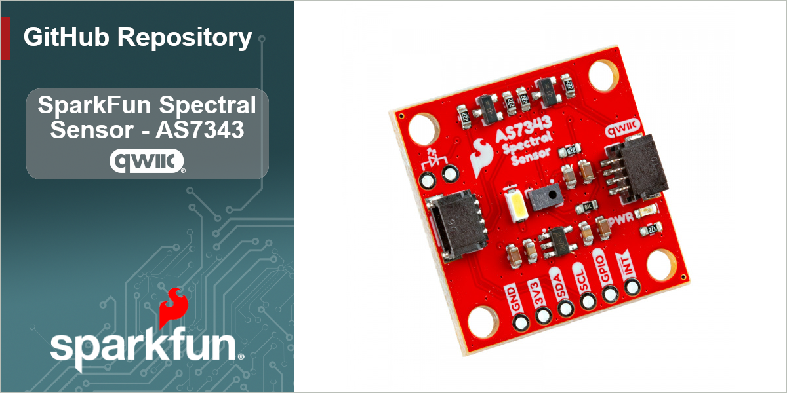

SparkFun Spectral Sensor - AS7343 (Qwiic)
=========================================
 

The SparkFun Spectral Sensor Breakout - AS7343 (Qwiic) offers a highly accurate but compact spectral analysis tool for both the visible spectrum and near-infrared. The AS7343 senses light between ~380mn to 1000mn over 14 channels with 11 color bands across the visible spectrum, one near-infrared channel, one clear channel (full sensing spectrum) along with flicker detection. The AS7343 also has an interrupt pin to trigger events based on specific measurements from the sensor as well as a programmable GPIO pin to help synchronize measurements with external devices. This breakout comes standard with a bright white LED for taking measurements but also includes connection points for users who wish to use their own LED if needed.

Repository Contents
-------------------

* **/Documentation** - Data sheets, additional product information
* **/Hardware** - Eagle design files (.brd, .sch)
* **/Production** - Production panel files (.brd)
* **/docs** -  Documentation files for the Spectral UV Sensor
* **/overrides** -  Overrides for GitHub pages content

Documentation
--------------
* **[Arduino Library](https://github.com/sparkfun/SparkFun_AS7343_Arduino_Library/tree/main)** - Arduino library for the Spectral Sensor - AS7343 (Qwiic).
* **[Python Package](https://github.com/sparkfun/qwiic_as7343_py)** - Python package for the Spectral Sensor - AS7343 (Qwiic)
* **[Hookup Guide](https://docs.sparkfun.com/SparkFun_Spectral_Sensor_Breakout_AS7343_Qwiic)** - Basic hookup guide for the Spectral Sensor - AS7343 (Qwiic).

Product Versions
----------------
* [SEN-23220](https://www.sparkfun.com/sparkfun-spectral-sensor-as7343-qwiic.html) - Spectral Sensor - AS7343 (Qwiic)

License Information
-------------------

This product is _**open source**_! 

Please review the LICENSE.md file for license information. 

If you have any questions or concerns on licensing, please contact technical support on our [SparkFun forums](https://forum.sparkfun.com/viewforum.php?f=152).

Distributed as-is; no warranty is given.

- Your friends at SparkFun.