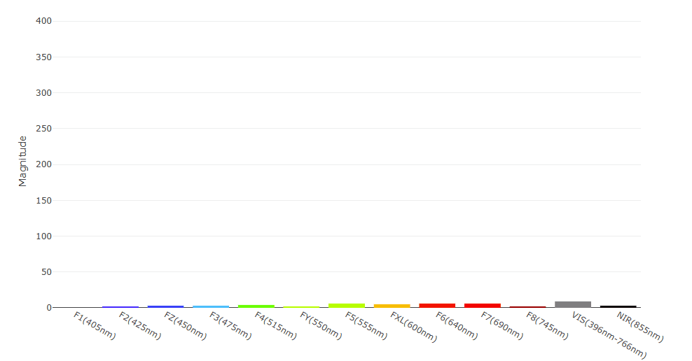

Let's take a closer look at the examples included in the SparkFun AS7343 Arduino Library. This section assumes users are following the assembly instructions from the Hardware Assembly/Qwiic Start sections and are using a SparkFun RedBoard IoT - ESP32.

## Example 1 - Basic Readings

The first example sets up the AS7343 to operate with default settings and outputs data from just four channels (Red, Green, Blue and NIR). Open the example in Arduino by navigating to **File** > **Examples** > **SparkFun AS7343 Arduino Library** > **Example_01_BasicReadings**. Next, select your board (RedBoard IoT - ESP32) and Port and click the "Upload" button. After the code finishes compiling and uploading, open the [serial monitor](https://docs.arduino.cc/software/ide-v2/tutorials/ide-v2-serial-monitor/) with the baud set to **115200** and you should see readings for red, blue, green and NIR print out like the screenshot below shows:

<figure markdown>
[{ width="600"}](./assets/img/AS7343_Arduino_Example1.jpg "Click to enlarge")
</figure>

## Example 2 - All Channels

Example 2 - All Channels shows how to set up the AS7343 with default settings to print out all spectral data from the sensor. This example is nearly identical to the first outside of the serial data printed out. Instead of getting and printing data from four specific channels, this example requests data from all channels and prints it as comma separated values. Open the example in Arduino by navigating to **File** > **Examples** > **SparkFun AS7343 Arduino Library** > **Example_02_AllChannels**. 

In order to get data from all channels, the AS7343 takes measurements in three cycles with each one stepping through four individual channels combined with readings from the Clear/VIS and Flicker Detect/FD which is then stored in the sensor's data registers. The example prints out spectral data stepping through each channel from 0 to 17 in comma-separated values:

```c++
    for (int channel = 0; channel < channelsRead; channel++)
    {
        Serial.print(myData[channel]);
        Serial.print(",");
    }

    Serial.println();
```

## Example 3 - Gain

The third example shows how to set up the AS7343 with specific Spectral Engines Gain Settigns (aka AGAIN) and cycle through the gain settings using serial commands. Open the example in Arduino by navigating to **File** > **Examples** > **SparkFun AS7343 Arduino Library** > **Example_03_Gain**. If necessary, select your board and port and click the "Upload" button. Open the serial terminal with the baud set to **115200** after the code finishes uploading. 

The example accepts serial inputs of "+" and "-" to step up and down, respectively, through the available gain settings and prints out the value of the gain each time it's updated:

```c++
    if(Serial.available())
    {
        userInput = Serial.read();
        if (userInput == '+' || userInput == '-')
        {
            updateGainSetting(userInput);
        }
    }
```

The code also prints out spectral readings from all channels every 1 second so'll want to pay close attention to the serial monitor when adjusting the gain value to see the returned serial data like the screenshot below shows:

<figure markdown>
[{ width="600"}](./assets/img/AS7343_Arduino_Example3.jpg "Click to enlarge")
</figure>

## Example 4 - Interrupt

The fourth example demonstrates how to set up the AS7343's interrupt pin to fire when values from a specific channel exceed a specified limit. The example defaults to watch channel FZ (450nm aka Blue) and trigger the interrupt when it reports values over 10 counts. The example defaults to use `D4` for the interrupt pin so depending on whether or not your board supports external interrupts adjust this line if needed:

```c++
#define INT_HW_READ_PIN 4 // Pin to read the interrupt pin from the AS7343
```

Not sure which pins on your development board support the `attachInterrupt()` function in Arduino? Take a look at [this page](https://docs.arduino.cc/language-reference/en/functions/external-interrupts/attachInterrupt/) for a more thorough reference on the function along with available interrupt pins for common Arduino development boards.

## Example 5 - Flicker Detection

Example five shows how to set up and monitor flicker detection readings from the sensor. It sets up the AS7343 with default settings with flicker detection enabled. It then checks to see if flicker detection values are invalid or saturated and prints out for either case:

**Flicker Detection is Invalid**
```c++
if (fdValid == false)
    {
        Serial.print("Flicker Detection Measurement Invalid");
        Serial.println();
        delay(1000);
        return;
    }
```
**Flicker Detection Saturated**
```c++
    if (fdSaturation == true)
    {
        Serial.print("Flicker Detection Saturation Detected");
        Serial.println();
        delay(1000);
        return;
    }
```

If the flicker detection value is valid and not saturated, it reads the value and prints it in Hz over serial:

```c++
    if(fdValid == true && fdSaturation == false)
    {
        if (fdFrequency == 0) // if getFlickerDetectionFrequency() returns 0, no frequency detected
            Serial.print("No Flicker Detected");
        else
        {
            Serial.print("Flicker Detected at frequency: ");
            Serial.print(fdFrequency);
            Serial.print("Hz");
        }
        Serial.println();
    }

    delay(1000);
```

## Example 6 - Sleep

Example six shows how to put the AS734 in and out of "sleep" to take intermittent measurements. Note, the AS7343 [datasheet](./assets/component_documentation/AS7343_DS001046_6-00.pdf) refers to each mode of operation as Sleep, Idle and Active. There is no direct control of a power mode but we can turn off the Measurement and the Power ON bits in the Enable register to put the AS7343 into a low power state that draws ~350uA. This example creates helper functions to wake the sensor, take a reading and then put the sensor back to sleep once every five seconds in the main loop:

```c++
void loop()
{
    takeReading(); // Wake up and take a reading from the sensor

    sleepSensor(); // Disables measurement (IDLE) and powers off (SLEEP)

    delay(5000); // Wait 5 seconds to allow reading sleep current if needed.
}
```

## Example 7 - Web Terminal Bar Graph

The seventh example takes data from all of the AS7343's channels (visible spectrum, NIR and clear) and formats it in a way to work with the SparkFun [Web Serial Plotter](https://docs.sparkfun.com/SparkFun_WebSerialPlotter/) tool to display the readings in a colorful bar graph. After uploading the code, open the [SparkFun Web Serial Plotter](https://docs.sparkfun.com/SparkFun_WebSerialPlotter/) site, select the COM port with the baud set to <b>115200</b> and click connect. You should start to see serial data print out in the top window along with a bar graph matching the channel data in the bottom window:

<figure markdown>
[{ width="600"}](./assets/img/spectral_bars_v10.gif "Click to enlarge")
</figure>