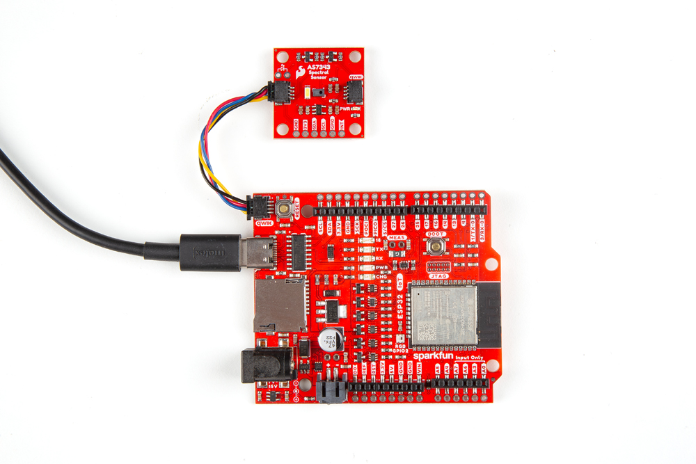

Now that we're familiar with the hardware on this Qwiic breakout, let's build it into a Qwiic circuit to start getting spectral data from the AS7343.

## Qwiic Assembly

The Qwiic system allows solderless connections for power and I2C so all you need to get up and running is a Qwiic cable and Qwiic compatible development board (or a Qwiic adapter cable). Assemble your Qwiic circuit by connecting the Spectral Sensor Breakout - AS7343 to your development board with the Qwiic cable and then connecting the development board to your computer over USB like the photo below shows:

<figure markdown>
[{ width="600"}](./assets/img/AS7343_Qwiic_Assembly.jpg)
</figure>

## Using an External LED

If you'd like to install your own LED on the breakout board you'll need to disable the on-board LED and solder in your chosen replacement. Start by opening the "WLED" solder jumper and then solder the new LED to the pads with the diode symbol (labeled <b>USER</b> on the reverse of the board). Make sure to match the LED's polarity to the diode symbol like the photo below shows:

<figure markdown>
[{ width="600"}](./assets/img/AS7343_User_LED.jpg "Click to enlarge")
</figure>

## Soldered Assembly

Users who prefer a soldered connection or need to use the AS7343's Interrupt and/or GPIO pins in a permanent assembly should solder to the 0.1"-spaced PTH header on the board. We opted to solder [straight headers](https://www.sparkfun.com/break-away-headers-straight.html) to this PTH header for prototyping the circuits for the Interrupt and GPIO code examples further along in this guide. 