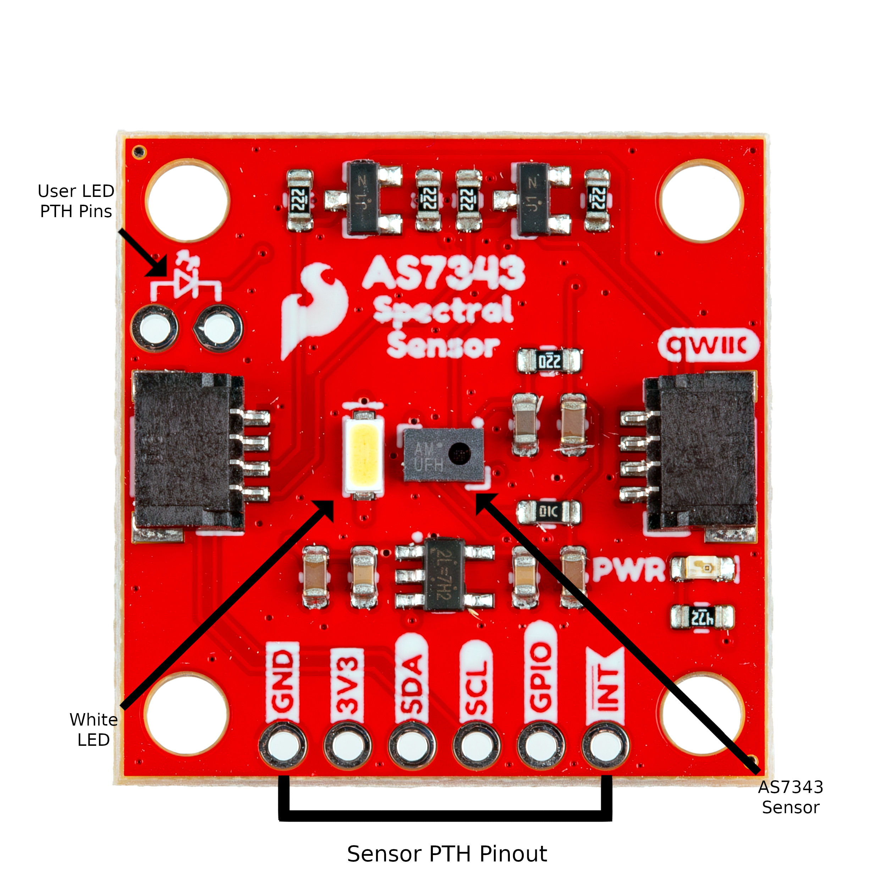
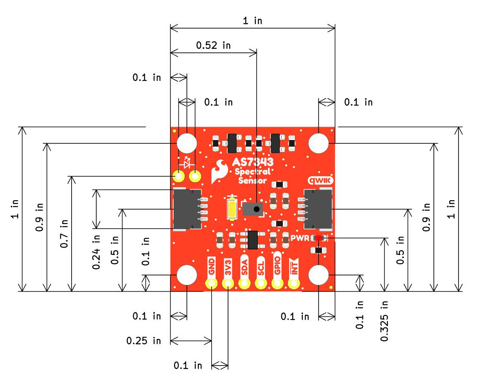

Let's take a closer look at the AS7343 and other hardware on the SparkFun Spectral Sensor Breakout - AS7343. The image below highlights the major components on this Qwiic breakout board:

<figure markdown>
[{ width="600"}](./assets/img/AS7343_Annotated.jpg "Click to enlarge")
</figure>

## AS7343 Spectral Sensor

The AS7343 from AMS&trade; measures irradiated, reflected and transmitted light in both the visible spectrum and near-infrared (NIR). The sensor features 14 channels in a 5x5 photodiode array, enabling the detection of 11 specific color bands across the visible spectrum. Additionally, dedicated photodiodes on the outer edges of this array are designed for near-infrared (845-865 nm) and flicker detection. It has exceptional sensitivity for measuring reflected, emitted and transmitted light even in low-light environments and also behind tinted glass. 

## Power

Power for the board can be supplied either over one of the Qwiic connectors or through the <b>3.3V</b> pin. The AS7343 accepts a supply voltage between <b>1.7V</b> and <b>2V</b> so the breakout includes an on board voltage regulator to drop the <b>3.3V</b> supplied over Qwiic or <b>3.3V</b> pin to <b>1.8V</b>. This regulator has a max input voltage of <b>5.5V</b>.

## Qwiic & Pinout

The AS7343 communicates over I2C and has an active low/high interrupt pin as well as a GPIO pin. The breakout routes the SDA/SCL lines from the AS7343 to a pair of Qwiic connectors as well as the 0.1"-spaced PTH header on the side of the board. The AS7343's interrupt and GPIO are also routed to this PTH.

## LEDs

The Spectral Sensor Breakout - AS7343 has two LEDs on the board labeled <b>PWR</b> and <b>WLED</b>. The red Power (PWR) LED indicates when the board is powered. The white (WLED) LED connects to the AS7343's LED current sink pin to illuminate objects/areas during sensor readings. Users can disable the on board white LED by opening the corresponding solder jumper and connect their own LED to the PTH pins labeled .

## Solder Jumpers

The board has three solder jumpers labeled <b>I2C</b>, <b>PWR</b> and <b>WLED</b>. The <b>I2C</b> jumper is a three-way jumper that pulls the SDA/SCL lines to <b>3.3V</b> through a pair of <b>2.2k&ohm;</b> resistors and is CLOSED by default. The board also includes level shifting to drop the logic down to <b>1.8V</b> . The <b>PWR</b> jumper completes the power LED circuit and is CLOSED by default. Open the solder jumper to disable the power LED. The <b>WLED</b> jumper completes the white LED circuit and is CLOSED by default.

## Board Dimensions

The SparkFun Spectral Sensor Breakout - AS7343 matches the Qwiic breakout standard and measures 1" x 1" (22.5mm x 22.5mm) and has four mounting holes that fit a [4-40 screw](https://www.sparkfun.com/screw-phillips-head-1-4-4-40-10-pack.html).

<figure markdown>
[{ width="600"}](./assets/board_files/SparkFun_AS7343_Qwiic-Dimensions.jpg "Click to enlarge")
</figure>