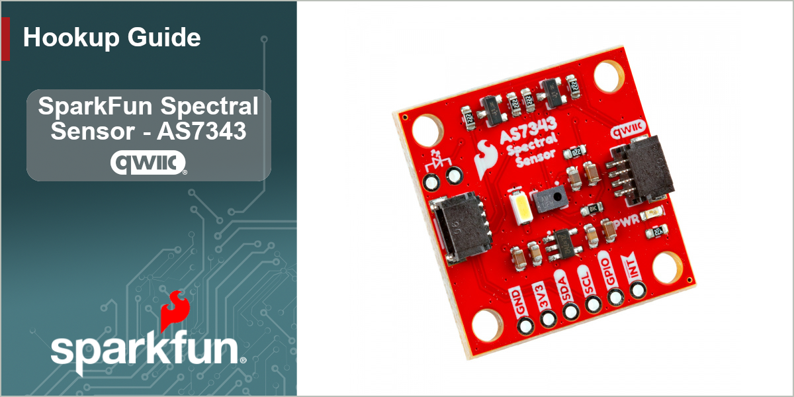

<figure markdown>

</figure>

The SparkFun Spectral Sensor Breakout - AS7343 (Qwiic) offers a highly accurate but compact spectral analysis tool for both the visible spectrum and near-infrared. The AS7343 senses light between ~380mn to 1000mn over 14 channels with 11 color bands across the visible spectrum, one near-infrared channel, one clear channel (full sensing spectrum) along with flicker detection. The AS7343 also has an interrupt pin to trigger events based on specific measurements from the sensor as well as a programmable GPIO pin to help synchronize measurements with external devices. This breakout comes standard with a bright white LED for taking measurements but also includes connection points for users who wish to use their own LED if needed.

This guide covers how to get spectral data from the AS7343 using both Arduino and MicroPython when connecting the Spectral Sensor Breakout to a compatible development board over Qwiic. In order to follow along with this guide you'll need the Spectral Sensor Breakout - AS7343 along with the following materials:

* [SparkFun IoT RedBoard - ESP32 MicroPython Development Board](https://www.sparkfun.com/sparkfun-iot-redboard-esp32-micropython-development-board.html) (or other Arduino/MicroPython development board)
* [Qwiic Cable](https://www.sparkfun.com/qwiic-cable-100mm.html)
* [USB-C Cable](https://www.sparkfun.com/usb-a-to-usb-c-cable-1m-usb-2-0-flexible-silicone.html) 

If you plan to use the AS7343's Interrupt/GPIO pins or prefer a soldered connection, you may need one or more of these materials along with a [soldering iron](https://www.sparkfun.com/tools/soldering/soldering-irons-and-tips.html) and [solder](https://www.sparkfun.com/tools/soldering/solder.html):

* [Breakaway Headers Straight](https://www.sparkfun.com/break-away-headers-straight.html)
* [Jumper Wires - Connected 6" (M/M, 20 pack)](https://www.sparkfun.com/jumper-wires-connected-6-m-m-20-pack.html)
* [Breadboard](https://www.sparkfun.com/breadboard-self-adhesive-white.html)

## Topics Covered

This document contains three main sections: **Quickstart Guide**, **Hardware** and **Software**. 

The Quickstart Guide assumes a working knowledge of how to use a development board and the required software to program them for your project's needs. It covers a quick assembly and then jumps right into getting the necessary software packages installed to start getting spectral data in just a few short minutes.

The Hardware pages are split into the Hardware Overview and Hardware Assembly. The Hardware Overview provides a detailed overview of the Spectral Sensor Breakout - AS7343 along with all the major components included on the board. Refer to this page for information on things like the AS7343, LEDs, pinout and solder jumpers. The Hardware Assembly page covers how to assemble the breakout in both a Qwiic circuit as well as how to use the optional soldered features such as the external LED and the AS7343's Interrupt/GPIO pins.

The Software pages are split into sections covering the SparkFun AS7343 Arduino Library and MicroPython driver. Each software page gives instructions on how to download install the software package (Arduino library or MicroPython driver), as well as detailed looks at the examples included in the software packages.

## Resources and Support Documentation 

You'll find the board design files (KiCad files & schematic), relevant documentation (datasheets, white papers, etc.) and other helpful links in the **Resources**. Lastly, the **Support** section includes a Troubleshooting page that includes any helpful tips specific to this board as well as information on how to receive technical support from SparkFun.