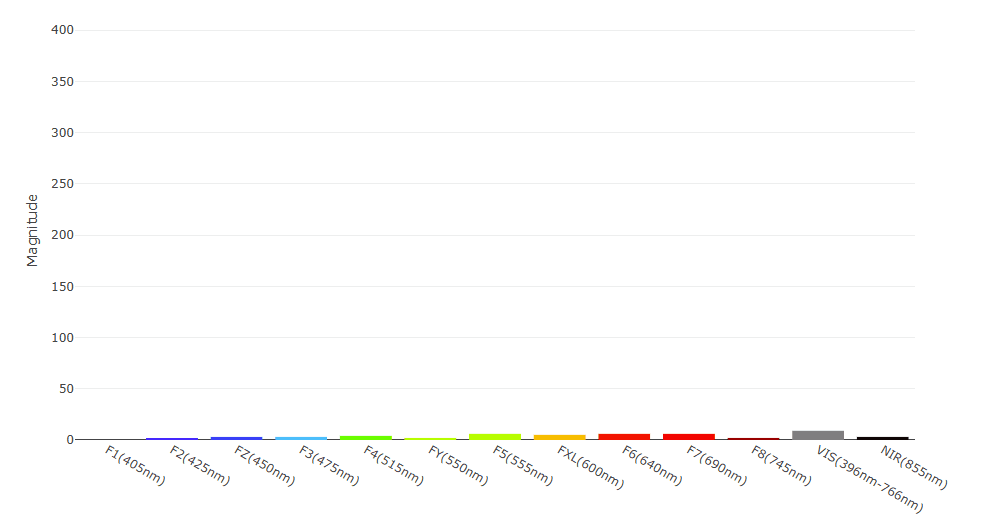

Let's take a quick look at each example included in the SparkFun AS7343 Python package. Note, the naming of these examples matches the examples in the Arduino library and skips from 3 to 5 as this package does not have an interrupt example (Example 4 in the Arduino library).

## Example 1 - Basic Readings

This simple example demonstrates how to set up the AS7343 with default settings and though it does set the AS7343 to report data from all 18 channels it only prints data for four channels (Red, Green, Blue and NIR) using this command:

```py
	print(myAS7343.get_blue(), end=',')
		print(myAS7343.get_red(), end=',')
		print(myAS7343.get_green(), end=',')
		print(myAS7343.get_nir(), end=',\n')
```

## Example 2 - All Channels

Example 2 demonstrates how to set up the AS7343 to output data from all channels on the sensor in comma-separated values by steping through all channels:

```py
	for i in range(0, myAS7343.kNumChannels):
			print(myAS7343.get_data(i), end=',')
		print()
```

## Example 3 - Gain

The third example shows how to set the gain for the AS7343. It defaults to set the gain as `512x` but you can adjust it in this line:

```py
if not myAS7343.set_a_gain(myAS7343.kAgain64):
```

Refer to the main .py file [here](https://github.com/sparkfun/qwiic_as7343_py/blob/master/qwiic_as7343.py#L102) for all allowed values for gain settings.

## Example 5 - Flicker Detection

The Flicker Detection example demonstrates how to use the AS7343's flicker detection feature. It initializes the sensor with default settings and then prints out flicker detection vlues in Hz to the serial monitor:

```py
if fdFrequency == 0:
			print("No flicker detected")
		else:
			print("Flicker detected at frequency: {} Hz".format(fdFrequency))

		time.sleep(1)
```

## Example 6 - Sleep

The sixth example shows how to create a `def` to cycle the AS7343 in and out of "sleep" between measurement reports to help conserve power:

```py
def sleep_device(device):
	# Disable spectral measurements
	if not device.spectral_measurement_disable():
		print("Failed to disable spectral measurements", file=sys.stderr)
		return
	print("Spectral measurements disabled")

	# Power off the device
	if not device.power_off():
		print("Failed to power off the device", file=sys.stderr)
		return
	print("Device powered off")
```

The main example then initializes the sensor with default settings, takes readings, puts it to sleep for 5 seconds and then loops:

```py
	while True:
		# Take a reading
		take_reading(myAS7343)

		# Put the device to sleep
		sleep_device(myAS7343)

		# Wait 5 seconds before taking another reading
		time.sleep(5.0)
```

Though there is no direct control of a power mode, the example turns off the measurement and Power ON bits in the Enable register to put the sensor into a low power state so it draws ~350&micro;A.

## Example 7 - Web Bar Graph

Example 7 shows how to use the Spectral Sensor with the SparkFun [Web Serial Plotter](https://docs.sparkfun.com/SparkFun_WebSerialPlotter/) to display spectral data from all channels in a neat and colorful bar graph. You'll need to run this on a microcontroller like the [IoT RedBoard - ESP32 MicroPython](https://www.sparkfun.com/sparkfun-iot-redboard-esp32-micropython-development-board.html) as the Web Serial Plotter connects over a serial COM port. The code initializes the AS7343 with default settings and then prints out the comma-separated values in a format compatible with the web serial plotter:

```py
print(f"{myAS7343.get_data(myAS7343.kChPurpleF1405nm)},"
          f"{myAS7343.get_data(myAS7343.kChDarkBlueF2425nm)},"
          f"{myAS7343.get_data(myAS7343.kChBlueFz450nm)},"
		  f"{myAS7343.get_data(myAS7343.kChLightBlueF3475nm)},"
		  f"{myAS7343.get_data(myAS7343.kChBlueF4515nm)},"
		  f"{myAS7343.get_data(myAS7343.kChGreenF5550nm)},"
		  f"{myAS7343.get_data(myAS7343.kChGreenFy555nm)},"
		  f"{myAS7343.get_data(myAS7343.kChOrangeFxl600nm)},"
		  f"{myAS7343.get_data(myAS7343.kChBrownF6640nm)},"
		  f"{myAS7343.get_data(myAS7343.kChRedF7690nm)},"
		  f"{myAS7343.get_data(myAS7343.kChDarkRedF8745nm)},"
		  f"{myAS7343.get_data(myAS7343.kChVis1)},"
		  f"{myAS7343.get_data(myAS7343.kChNir855nm)}\n", end='')
```

After running the example, open the [Web Serial Plotter](https://docs.sparkfun.com/SparkFun_WebSerialPlotter/) and select the COM port and click "Connect" and you should see serial data print out in the top window and a nice colorful bar graph in the bottom window like the gif below shows:

<figure markdown>
[{ width="600"}](./assets/img/spectral_bars_v10.gif "Click to enlarge")
</figure>