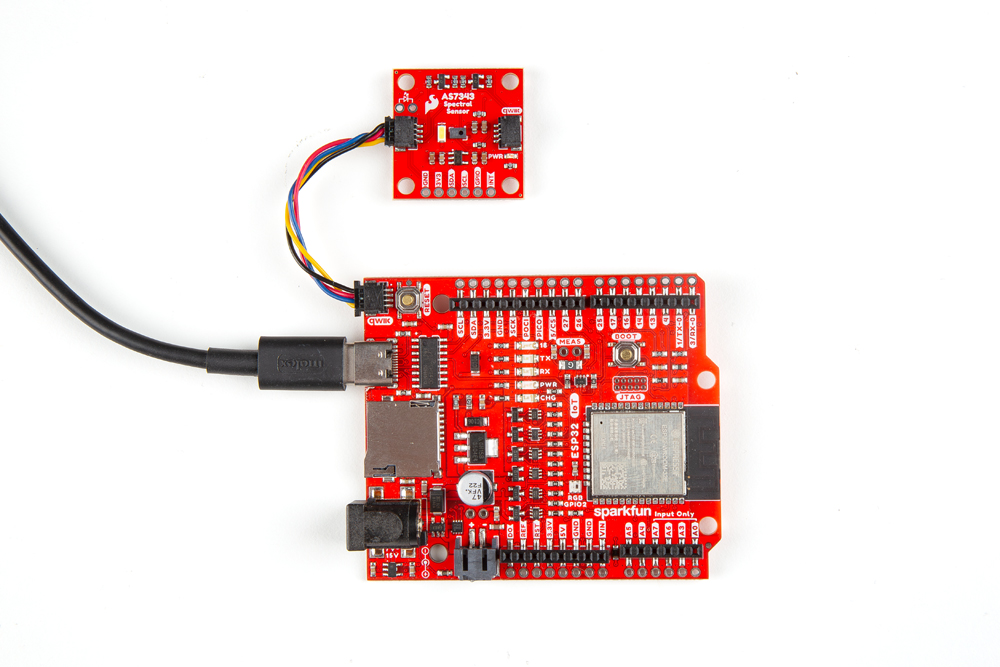

In this Quick Start Guide we'll connect the SparkFun Spectral Sensor Breaout - AS7343 (Qwiic) to an IoT RedBoard - ESP32 to output measurements of visible and near-infrared light and display them in a colorful web terminal bar graph.

If you're not familiar with using sensor breakouts, development boards or the development environments covered in this guide, refer to the [Hardware](./hardware_overview.md) & [Arduino Setup](./arduino_setup.md) sections of this Hookup Guide for a detailed overview of the board along with instructions on setting up and using the SparkFun AS7343 Arduino Library.

## Basic Assembly

As this is a Qwiic breakout, assembling the circuit only requires connecting the sensor breakout to a Qwiic-compatible development board like the IoT RedBoard - ESP32. Connect the Spectral Sensor Breakout to the IoT RedBoard with a Qwiic cable and then connect the IoT RedBoard to your computer with a USB-C cable like the photo below demonstrates:

<figure markdown>
[{ width=600}](./assets/img/AS7343_Qwiic_Assembly.jpg "Click to enlarge")
</figure>

## Software Setup

The IoT RedBoard - RP2350 comes pre-loaded with MicroPython firmware so users who want to run the example in MicroPython can move on to the Example section below. Arduino requires installing the proper board definitions for the IoT RedBoard - RP2350 (or alternate Arduino dev board of your choosing).

### SparkFun AS7343 & Toolkit Arduino Libraries

Install the SparkFun AS7343 Arduino library and SparkFun Toolkit with the [Arduino Library Manager](https://docs.arduino.cc/software/ide-v1/tutorials/installing-libraries/) and search for "SparkFun AS7343" and "SparkFun Toolkit". Make sure to install the latest releases.

### IoT RedBoard Definitions

The IoT RedBoard - ESP32 is included in the ESP32 boards package from espressif. Install the boards package in the [Arduino Boards Manager](https://docs.arduino.cc/software/ide-v2/tutorials/ide-v2-board-manager/) by searching for "ESP32" and install the latest version.

## Web Terminal Bar Graph Example

The bar graph examples for both Arduino & MicroPython set up the AS7343 to output from all channels and format the data so the web terminal can read it and display it in a bar graph. The Web Terminal Bar Graph example must be run in a Chromium-based browser (sorry, no Firefox) and just requires a serial connection over USB.

* Open "Example 7 - Web Terminal Bar Graphs" in Arduino and select your board (IoT RedBoard - ESP32) and Port.
* Click the "Upload" button and wait for the code to finish compiling and uploading.
* Open [this link]() in a browser and select the COM port of the IoT RedBoard.
* Try moving the Spectral Sensor around and pointing it at different objects/colors and watch the Bar Graph in the bottom half of the window update every 1s like the gif below.

<figure markdown>
[](./assets/img/spectral_bars_v10.gif)
</figure>

**Code to Note**

The code begins by setting the AS7343 to operate with default settings and prints out whether or not it fails or begins:

```c++
    if (mySensor.begin() == false)
    {
        Serial.println("Sensor failed to begin. Please check your wiring!");
        Serial.println("Halting...");
        while (1)
            ;
    }

    Serial.println("Sensor began.")
```

After initializing the sensor and powering it on, the code then sets the AS7343's AutoSmux to output all 18 channels and prints out the result:

```c++
    if (mySensor.setAutoSmux(AUTOSMUX_18_CHANNELS) == false)
    {
        Serial.println("Failed to set AutoSmux.");
        Serial.println("Halting...");
        while (1)
            ;
    }
    Serial.println("AutoSmux set to 18 channels.");
```

The main loop turns the white LED on to illuminate the sensing area and then takes a reading from all channels once per second:

```c++
    mySensor.ledOn();
    delay(100);

    // Read all data registers
    // if it fails, print a failure message and continue
    if (mySensor.readSpectraDataFromSensor() == false)
    {
        Serial.println("Failed to read spectral data.");
    }
```

Finally, in order to format the data for the web serial terminal, the code fills the buffer with channel data in a specific order and prints the buffer for the web terminal to output the bar graph data correctly:

```c++
    sprintf(buffer, "%d,%d,%d,%d,%d,%d,%d,%d,%d,%d,%d,%d,%d\n",
           mySensor.getChannelData(CH_PURPLE_F1_405NM),
           mySensor.getChannelData(CH_DARK_BLUE_F2_425NM),
           mySensor.getChannelData(CH_BLUE_FZ_450NM),
           mySensor.getChannelData(CH_LIGHT_BLUE_F3_475NM),
           mySensor.getChannelData(CH_BLUE_F4_515NM),
           mySensor.getChannelData(CH_GREEN_F5_550NM),
           mySensor.getChannelData(CH_GREEN_FY_555NM),
           mySensor.getChannelData(CH_ORANGE_FXL_600NM),
           mySensor.getChannelData(CH_BROWN_F6_640NM),
           mySensor.getChannelData(CH_RED_F7_690NM),
           mySensor.getChannelData(CH_DARK_RED_F8_745NM),
           mySensor.getChannelData(CH_VIS_1),
           mySensor.getChannelData(CH_NIR_855NM));

    Serial.print(buffer);
```